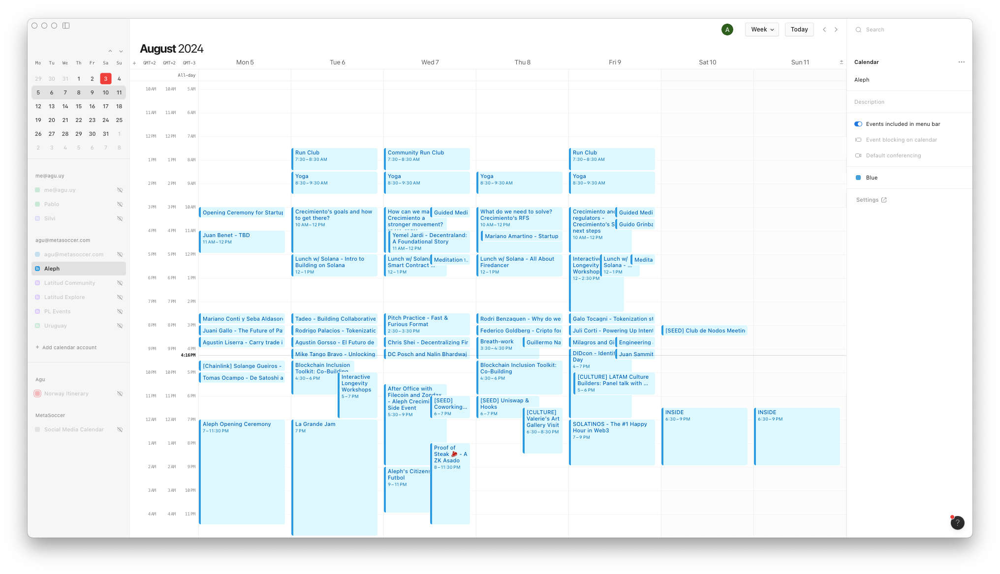

# Aleph Calendar

A Node.js server using Express to dynamically generate and serve iCal files from events fetched via aleph.sola.day GraphQL API.



## Features

- **Dynamic iCal Generation**: Fetches events from a specified GraphQL API and generates an iCal file on-the-fly.
- **Timezone Handling**: Properly handles timezone conversion for events.

## Setup and Deployment

### Prerequisites

- Node.js and npm installed.
- Mailgun account for sending emails.
- Vercel account for deployment (optional).

### Installation

1. **Clone the repository**:
   ```sh
   git clone https://github.com/agurod42/aleph-calendar.git
   cd aleph-calendar
   ```

2. **Install dependencies**:
   ```sh
   npm install
   ```

3. **Configure environment variables**: Create a `.env` file in the root directory with the following variables:
   ```env
   PORT=3000
   MAILGUN_API_KEY=your-mailgun-api-key
   MAILGUN_DOMAIN=your-mailgun-domain
   MAILGUN_EMAIL_USER=your-mailgun-email-user
   MAILGUN_RECIPIENT_EMAIL=your-recipient-email
   ```

### Running the Server Locally

```sh
npm start
```

### Deploying to Vercel

1. **Install Vercel CLI** (if not already installed):
   ```sh
   npm install -g vercel
   ```

2. **Deploy**:
   ```sh
   vercel
   ```

Follow the prompts to deploy your project. Once deployed, you will get a URL where your server is hosted.

## Usage

Once deployed, you can access the iCal file by navigating to `/calendar.ics` on your server. The server will automatically fetch events from the GraphQL API, generate the iCal file, and send notification emails if there are any changes in the events.

## Adding the iCal to Calendar Apps

### Apple Calendar (Mac)

1. Open the Calendar app on your Mac.
2. From the "File" menu, select "New Calendar Subscription".
3. Enter the URL of the calendar file (e.g., `https://aleph-calendar.vercel.app/calendar.ics`).
4. Click "Subscribe".
5. Adjust the settings as needed and click "OK".

More details [here](https://support.apple.com/guide/calendar/subscribe-to-calendars-icl1022/mac).

### Google Calendar

1. Open Google Calendar.
2. On the left side, find "Other calendars" and click the dropdown arrow.
3. Select "Add by URL".
4. Enter the URL of your calendar file (e.g., `https://aleph-calendar.vercel.app/calendar.ics`).
5. Click "Add Calendar". The calendar will appear on the left side under "Other calendars".

More details [here](https://support.google.com/calendar/answer/37100).

### Outlook

1. Go to your Outlook calendar.
2. Click "Add calendar" from the toolbar.
3. Select "From Internet".
4. Enter the URL of the calendar file (e.g., `https://aleph-calendar.vercel.app/calendar.ics`).
5. Click "OK".

More details [here](https://support.microsoft.com/office/import-or-subscribe-to-a-calendar-in-outlook-on-the-web-503ffaf6-7b86-44fe-8dd6-8099d95f38df).

## License

This project is licensed under the MIT License.
